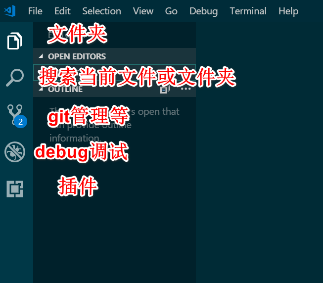

### 下载并安装[vscode](https://code.visualstudio.com/)

### 快捷键

Ctrl+P    Go To file

Ctrl+Shift+P  Show All Commands

Ctrl+Shift+F  Find in Files

F5 Start Debugging

Ctrl+`  Toggle Teminal

Alt+shift+F 快速格式化，将代码前多余的空格去掉

ctrl+shift+左键 或ctrl可以点击选   相同关键字的列选择

### 设置

去掉代码前面的对齐线

"editor.renderIndentGuides": false,

随窗口自动换行

"editor.wordWrap": "on",

选中字体的背景颜色

    "workbench.colorCustomizations": {
       "editor.selectionBackground": "#c4ec11",
    },
添加代码段

文件 => 首选项 => 用户代码片段1. 所有的代码片段需要用""或''包裹

2. \\t表示制表符
3. 空的一行必须用''或""包裹
4. $1代表光标第一次出现的位置，$2代表按下tab后光标第二次出现的位置

提示文件路径（Path Autocomplete）

"path-autocomplete.extensionOnImport": true,

首行默认缩进两个字符

"editor.tabSize": 2,"editor.detectIndentation": false,

不显示菜单栏

Ctrl+shift+p》设置》"window.menuBarVisibility": "default",

Cannot validate since no PHP executable is set. Use the setting 'php.validate.executablePath' to configure the PHP executable.无法使用PHP可执行的设置。设置php.validate。executablePath配置PHP可执行文件。

“php.validate.executablePath(C://php//php5.4.12//php.exePHP可执行文件地址)”

### 菜单简介




###  必要插件

#### vscode-icons(各文件对应的图标)

#### Project Manager

项目保存

项目切换（shift+alt+p;直接点击对应的文件夹进行切换)

#### Beautify（格式化代码）Format Document

    "beautify.config": {"jsbeautifyrc":{
       "eol": "\n",//每项之间用空行隔开
        "e4x": true,
        "js": {
            "end_with_newline": true
        },
        "html": {
            "extra_liners": []
        }
    }},
#### Code Runner一键搭建各类语言的学习测试环境

#### Debugger for Chrome如何和 Chrome 联动调试

- 两种方式（独立启动launch；附加到进程attach（永久设置，独立设置）

#### ESLint实时自动检测你的代码规范与代码中的错误

ESLint实时自动检测你的代码规范与代码中的错误

#### 提升 React 等前端开发的效率-智能提示及补全

npm

#### IntelliSense for CSS class names in HTML

Path Intellisense

TypeScript Hero

npm Intellisense

#### 美化终端 适配字体的配置One Dark Pro### 

####  @sort:installs

#### Bootstrap 3 Snippets

#### Easy LESS+Preview on web server 自动将less转为css文件

#### JavaScript (ES6) code snippets

#### prettify json格式化json

jQuery Code Snippets

Live Server

open in browser

#### Path Autocomplete

Vetur

vscode-lightning-linters

Vue 2 Snippets

```
{
 "files.autoSave": "afterDelay",
 "editor.wordWrap": "on",
 "editor.detectIndentation": false,
 "editor.tabSize": 2,
 "workbench.colorTheme": "Solarized Dark",
 "files.trimTrailingWhitespace": true,
 "workbench.colorCustomizations": {
  "terminal.ansiBlack": "#00c3ff"
 },
 "php.validate.executablePath": "C://wamp//bin//php//php5.4.12//php.exe",
 "editor.formatOnSave": true,
 "beautify.language": {
  "js": {
   "type": [
    "javascript",
    "json"
   ],
   "filename": [
    ".jshintrc",
    ".jsbeautify"
   ]
  },
  "css": [
   "css",
   "scss"
  ],
  "html": [
   "htm",
   ".html",
   "html"
  ]
 },
 "path-autocomplete.extensionOnImport": true,
 "lightningLinter.ignoreWarnings": true,
 "lightningLinter.useSfdx": true,
 "[javascript]": {},
 "workbench.statusBar.visible": true,
 "workbench.activityBar.visible": true,
 "editor.multiCursorModifier": "ctrlCmd",
 "explorer.confirmDragAndDrop": false,
 "liveServer.settings.port": 3000,
 "workbench.iconTheme": "vs-seti",
 "workbench.tips.enabled": true,
 "zenMode.hideTabs": false,
 "editor.renderControlCharacters": true,
 "window.zoomLevel": 0,
"editor.renderLineHighlight": "all",
}
```

